# PDM Data Flow Diagrams

## 🔄 Core Data Flows

### **1. User Onboarding & Identity Setup**

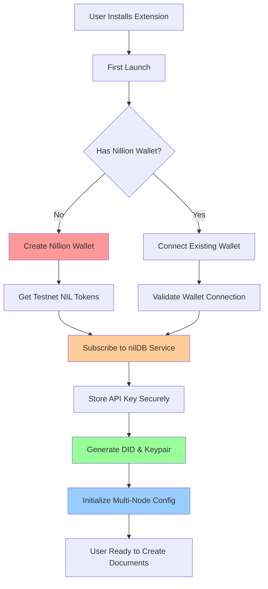

### **2. Document Creation Flow**

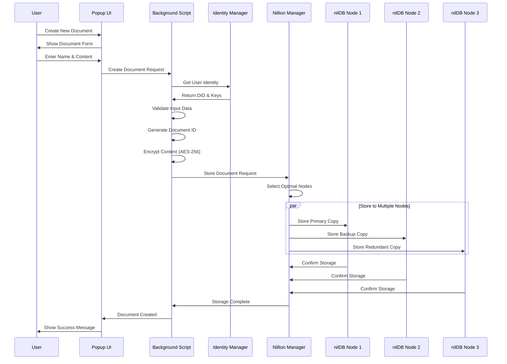

### **3. Permission Grant Flow**

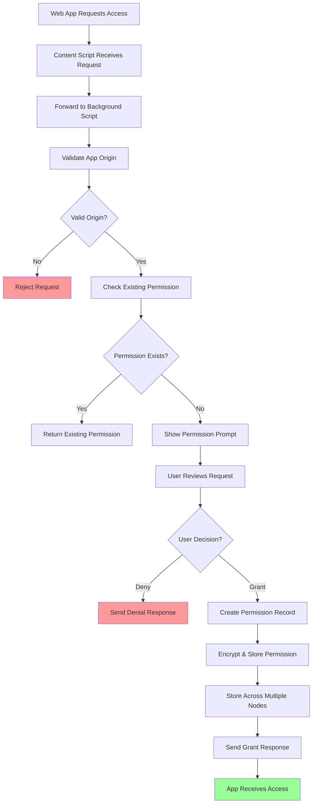

### **4. Data Retrieval Flow**

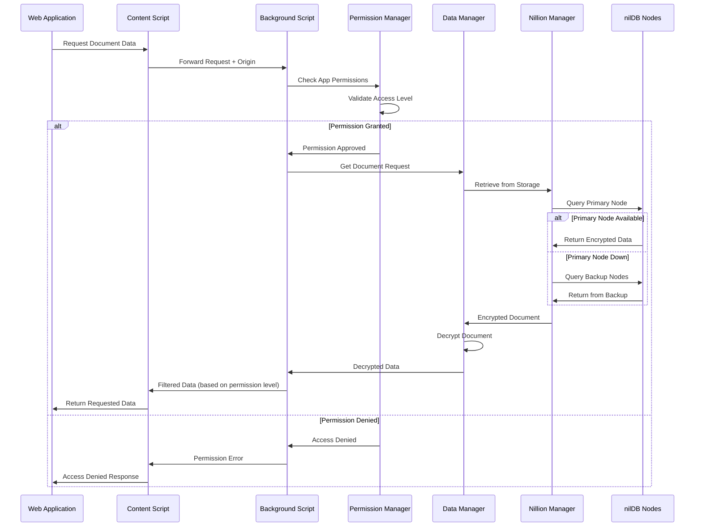

### **5. Multi-Node Failover Flow**

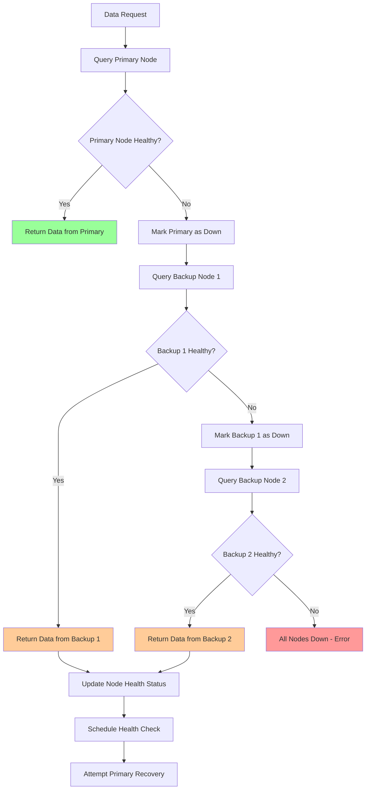

## 🔒 Security Data Flows

### **6. Encryption & Key Management Flow**

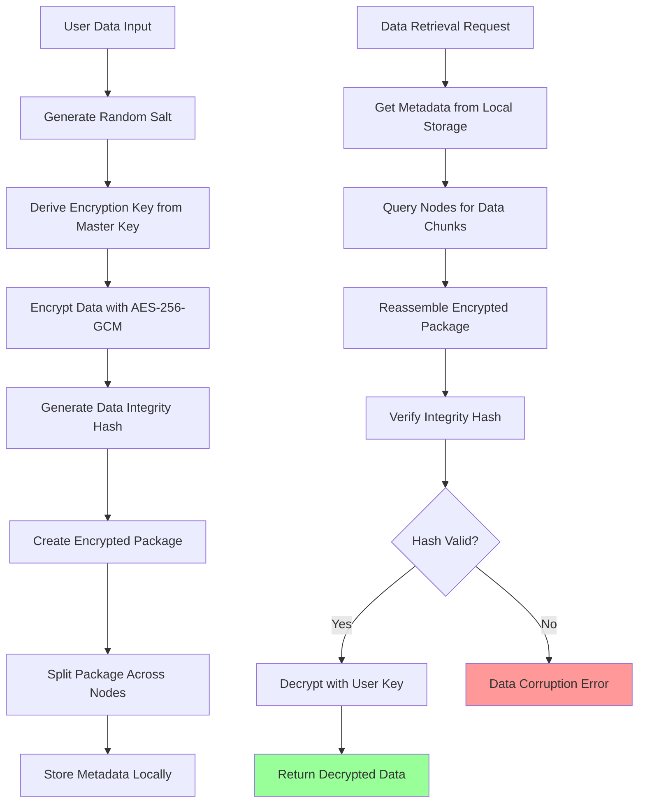

### **7. Permission Validation Flow**

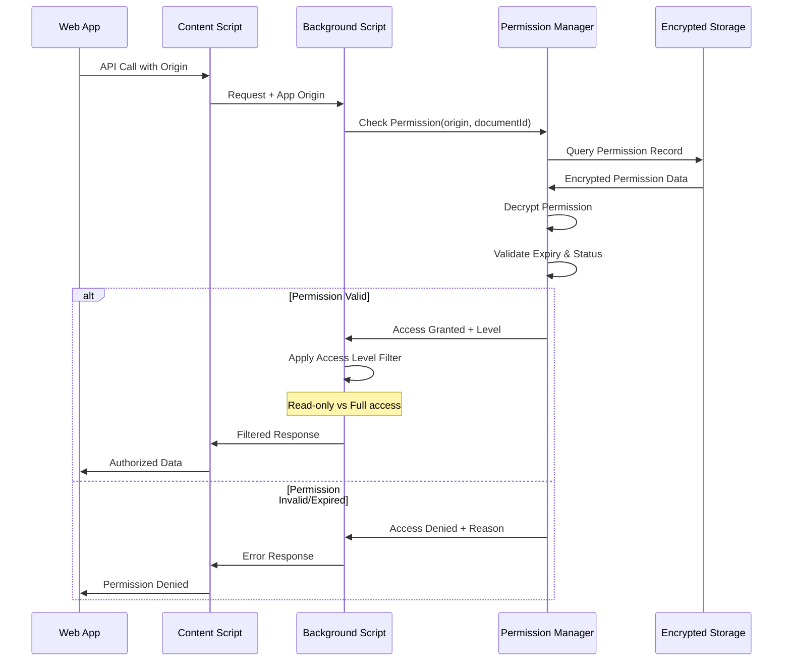

## 🌐 Cross-Component Communication

### **8. Extension Internal Communication Flow**

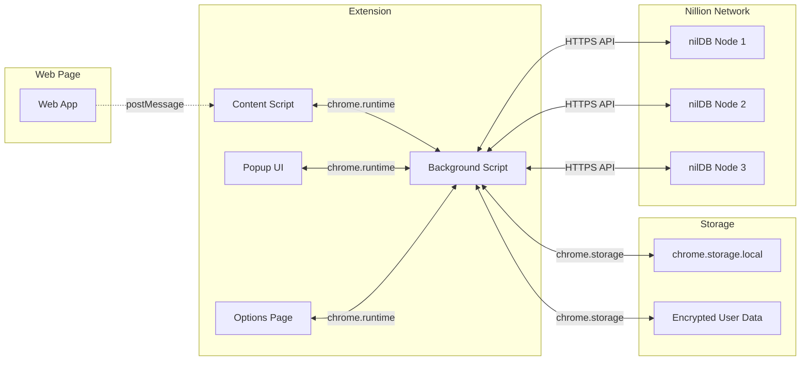

### **9. Real-Time Permission Management**

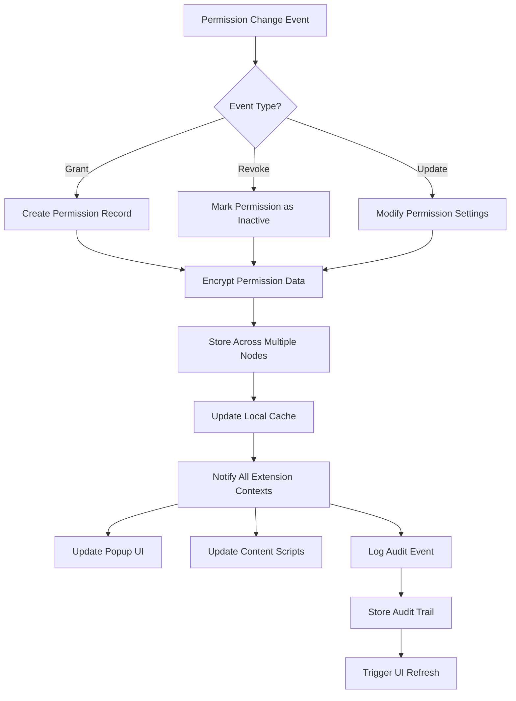

## 📊 Data Consistency Flows

### **10. Data Synchronization Across Nodes**

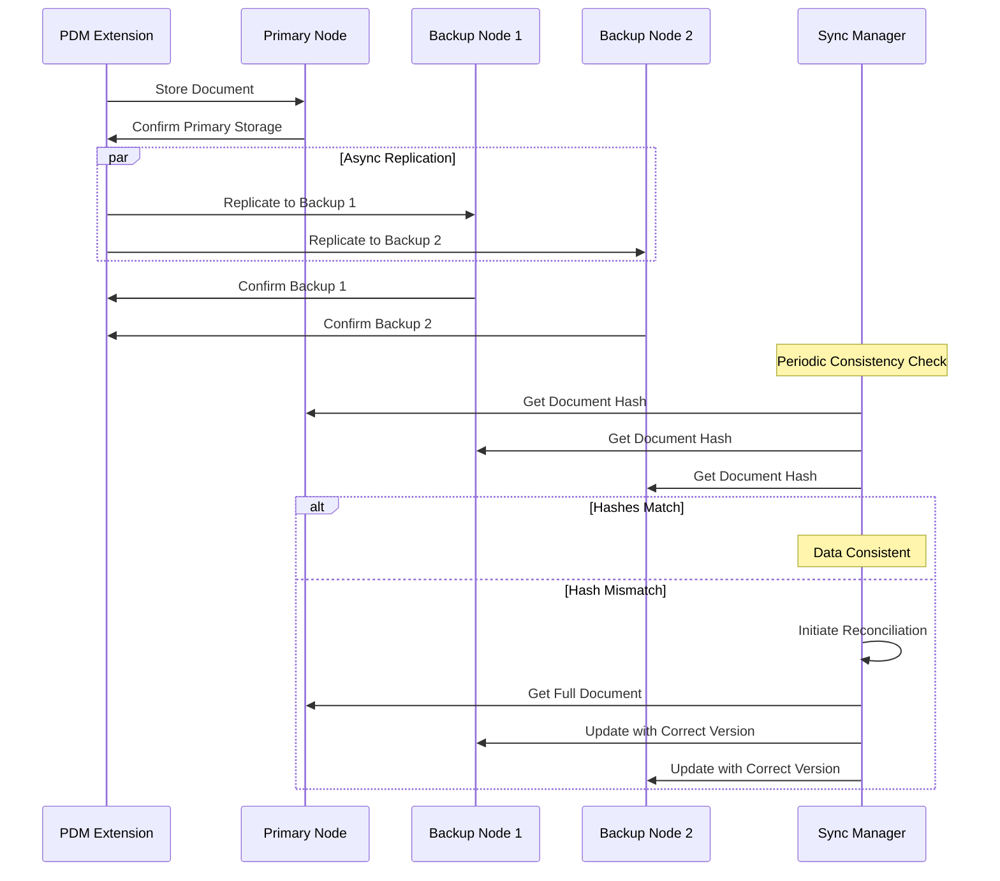

### **11. Error Handling & Recovery Flow**

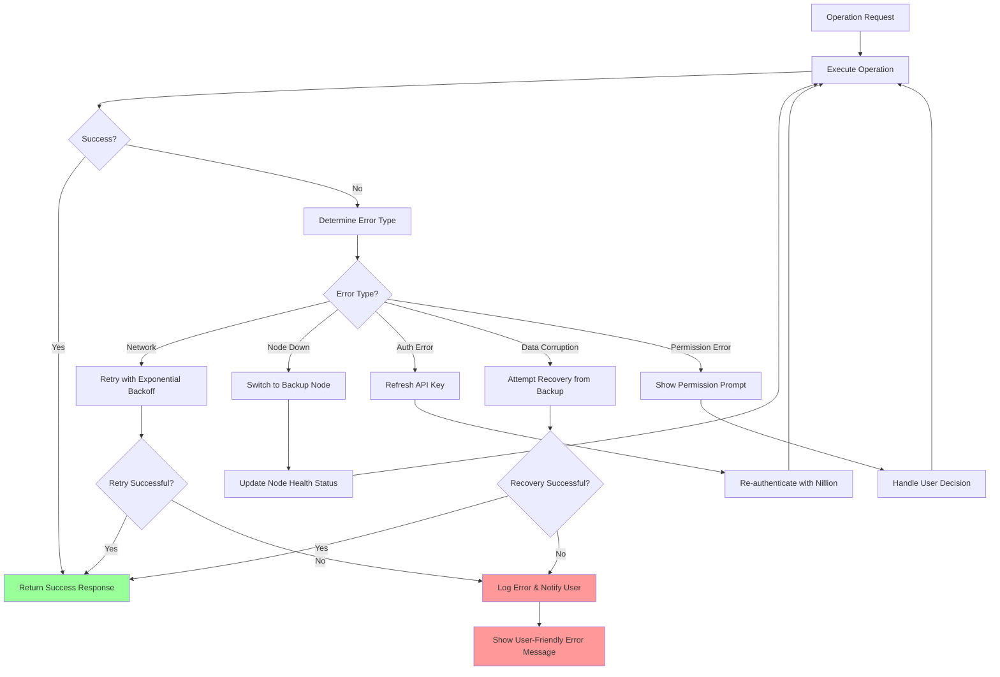

## 🔄 State Management Flow

### **12. Extension State Synchronization**

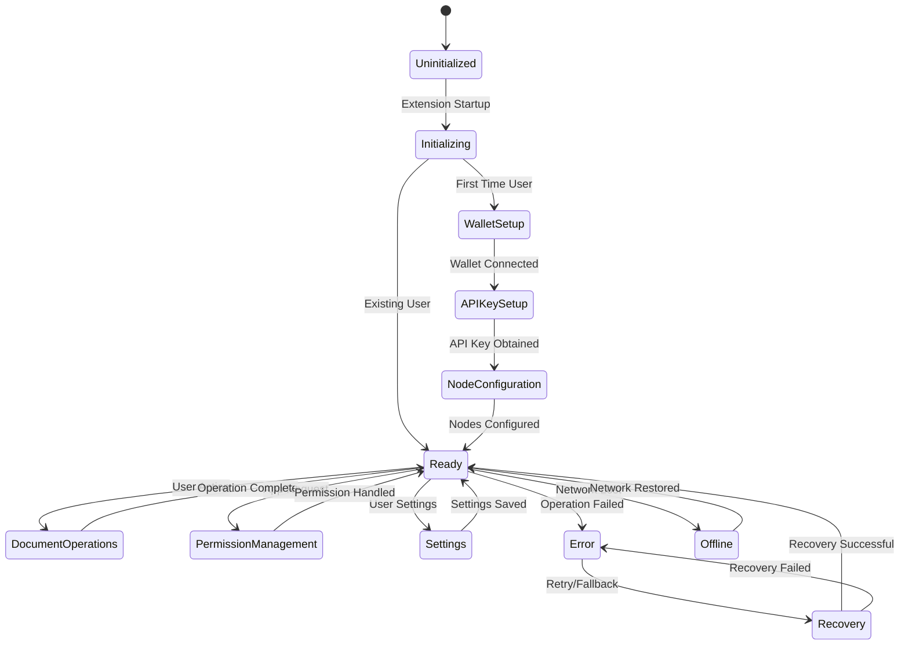

---

## 📋 Implementation Notes

### **Key Design Principles:**
1. **Multi-Node Redundancy**: All critical data stored across 3+ nodes
2. **Graceful Degradation**: System continues operating with reduced functionality
3. **Security First**: All sensitive data encrypted before storage
4. **Real-Time Updates**: Permission changes propagate immediately
5. **User Control**: Clear consent flows for all data operations

### **Performance Optimizations:**
- **Async Operations**: Non-blocking UI during network operations
- **Local Caching**: Frequently accessed data cached locally
- **Lazy Loading**: Load data only when needed
- **Connection Pooling**: Reuse connections to Nillion nodes

### **Error Recovery Strategies:**
- **Exponential Backoff**: For transient network errors
- **Circuit Breaker**: Prevent cascading failures
- **Fallback Nodes**: Automatic failover to healthy nodes
- **Data Recovery**: Reconstruct from multiple sources if needed

These data flow diagrams provide a comprehensive blueprint for implementing the PDM extension with production-grade reliability and security.