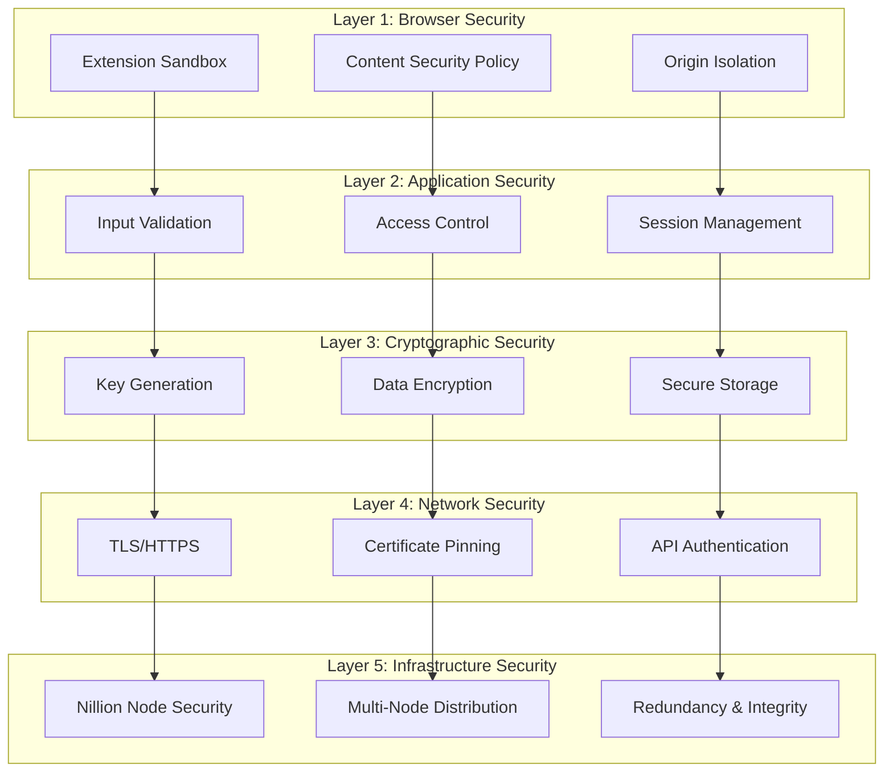
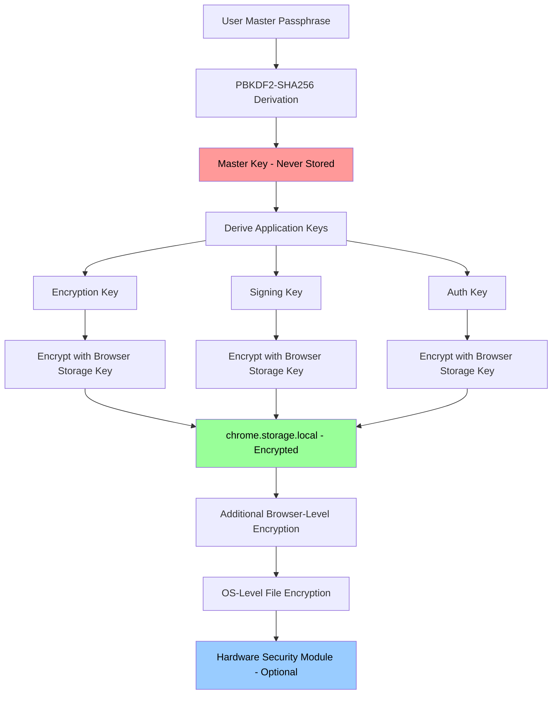
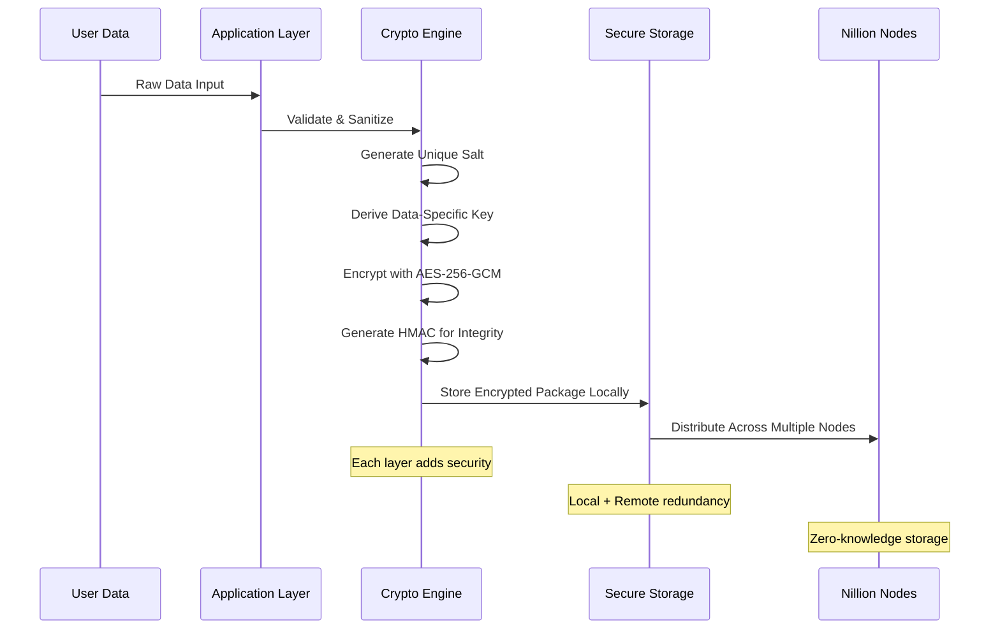
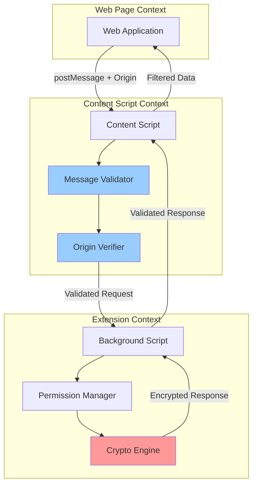

# PDM Security Architecture - Key Storage & Cryptographic Design

## 🔐 Security Overview

The PDM extension implements a **defense-in-depth** security model with multiple layers of protection for user keys, data, and communications. This architecture ensures that even if one layer is compromised, user data remains secure.

## 🏗 Security Architecture Layers



## 🔑 Key Management Architecture

### **1. Key Hierarchy & Types**

```typescript
interface KeyHierarchy {
  // Master Key (Never stored, derived from user input)
  masterKey: {
    source: 'user_passphrase' | 'hardware_token' | 'biometric';
    derivation: 'PBKDF2-SHA256' | 'Argon2id';
    iterations: 100000; // Minimum
  };

  // Application Keys (Derived from Master Key)
  applicationKeys: {
    encryptionKey: 'AES-256-GCM'; // For data encryption
    signingKey: 'Ed25519';        // For data integrity
    authKey: 'HMAC-SHA256';       // For API authentication
  };

  // Session Keys (Ephemeral, rotated regularly)
  sessionKeys: {
    communicationKey: 'ChaCha20-Poly1305'; // For extension communication
    nonceKey: 'Random-256bit';              // For preventing replay attacks
  };

  // Nillion Integration Keys
  nillionKeys: {
    walletPrivateKey: 'secp256k1';    // Nillion wallet integration
    apiKey: 'UUID-v4';               // nilDB service access
    collectionKeys: 'AES-256-GCM[]'; // Per-collection encryption
  };
}
```

### **2. Key Storage Security Model**



### **3. Secure Key Derivation Implementation**

```typescript
class SecureKeyManager {
  private static readonly SALT_LENGTH = 32;
  private static readonly KEY_LENGTH = 32;
  private static readonly PBKDF2_ITERATIONS = 100000;

  /**
   * Derive master key from user passphrase (never stored)
   */
  async deriveMasterKey(passphrase: string, salt: Uint8Array): Promise<CryptoKey> {
    const encoder = new TextEncoder();
    const keyMaterial = await crypto.subtle.importKey(
      'raw',
      encoder.encode(passphrase),
      'PBKDF2',
      false,
      ['deriveBits', 'deriveKey']
    );

    return await crypto.subtle.deriveKey(
      {
        name: 'PBKDF2',
        salt: salt,
        iterations: this.PBKDF2_ITERATIONS,
        hash: 'SHA-256'
      },
      keyMaterial,
      { name: 'AES-GCM', length: 256 },
      false, // Not extractable
      ['encrypt', 'decrypt']
    );
  }

  /**
   * Generate application-specific keys from master key
   */
  async deriveApplicationKeys(masterKey: CryptoKey): Promise<ApplicationKeys> {
    const encryptionKey = await this.deriveSpecificKey(masterKey, 'encryption');
    const signingKey = await this.deriveSpecificKey(masterKey, 'signing');
    const authKey = await this.deriveSpecificKey(masterKey, 'authentication');

    return { encryptionKey, signingKey, authKey };
  }

  /**
   * Secure key storage with double encryption
   */
  async secureStoreKey(key: CryptoKey, keyId: string): Promise<void> {
    // Export key for storage
    const keyData = await crypto.subtle.exportKey('raw', key);

    // Generate storage-specific encryption key
    const storageKey = await this.generateStorageKey();

    // Encrypt the key before storage
    const encryptedKey = await this.encryptForStorage(keyData, storageKey);

    // Store in chrome.storage.local with additional metadata
    await chrome.storage.local.set({
      [`key_${keyId}`]: {
        data: Array.from(encryptedKey),
        timestamp: Date.now(),
        version: '1.0',
        algorithm: 'AES-256-GCM'
      }
    });
  }
}
```

## 🛡 Data Protection Mechanisms

### **4. Multi-Layer Encryption Strategy**



### **5. Encryption Implementation Details**

```typescript
interface EncryptionPackage {
  // Encrypted data
  ciphertext: Uint8Array;

  // Cryptographic metadata
  iv: Uint8Array;           // Initialization Vector
  salt: Uint8Array;         // Unique salt for key derivation
  authTag: Uint8Array;      // Authentication tag (GCM mode)

  // Integrity verification
  hmac: Uint8Array;         // HMAC for additional integrity

  // Metadata
  algorithm: 'AES-256-GCM';
  version: '1.0';
  timestamp: number;

  // Multi-node distribution info
  nodeDistribution: {
    nodeId: string;
    chunkIndex: number;
    totalChunks: number;
  }[];
}

class DataEncryption {
  /**
   * Encrypt data with multiple security layers
   */
  async encryptData(plaintext: string, documentId: string): Promise<EncryptionPackage> {
    // Generate unique salt and IV
    const salt = crypto.getRandomValues(new Uint8Array(32));
    const iv = crypto.getRandomValues(new Uint8Array(12));

    // Derive document-specific encryption key
    const encryptionKey = await this.deriveDocumentKey(documentId, salt);

    // Encrypt with AES-256-GCM
    const encoder = new TextEncoder();
    const plaintextBytes = encoder.encode(plaintext);

    const encrypted = await crypto.subtle.encrypt(
      {
        name: 'AES-GCM',
        iv: iv,
        additionalData: encoder.encode(documentId) // Bind to document ID
      },
      encryptionKey,
      plaintextBytes
    );

    // Extract ciphertext and auth tag
    const ciphertext = new Uint8Array(encrypted.slice(0, -16));
    const authTag = new Uint8Array(encrypted.slice(-16));

    // Generate HMAC for additional integrity
    const hmacKey = await this.deriveHMACKey(encryptionKey);
    const hmac = await this.generateHMAC(hmacKey, ciphertext, iv, salt);

    return {
      ciphertext,
      iv,
      salt,
      authTag,
      hmac,
      algorithm: 'AES-256-GCM',
      version: '1.0',
      timestamp: Date.now(),
      nodeDistribution: await this.planNodeDistribution(ciphertext)
    };
  }

  /**
   * Decrypt data with integrity verification
   */
  async decryptData(encPackage: EncryptionPackage, documentId: string): Promise<string> {
    // Verify HMAC first
    const hmacKey = await this.deriveHMACKey(
      await this.deriveDocumentKey(documentId, encPackage.salt)
    );

    const expectedHMAC = await this.generateHMAC(
      hmacKey,
      encPackage.ciphertext,
      encPackage.iv,
      encPackage.salt
    );

    if (!this.constantTimeCompare(encPackage.hmac, expectedHMAC)) {
      throw new Error('Data integrity verification failed');
    }

    // Reconstruct full encrypted data
    const fullCiphertext = new Uint8Array(
      encPackage.ciphertext.length + encPackage.authTag.length
    );
    fullCiphertext.set(encPackage.ciphertext);
    fullCiphertext.set(encPackage.authTag, encPackage.ciphertext.length);

    // Derive decryption key
    const decryptionKey = await this.deriveDocumentKey(documentId, encPackage.salt);

    // Decrypt
    const encoder = new TextEncoder();
    const decrypted = await crypto.subtle.decrypt(
      {
        name: 'AES-GCM',
        iv: encPackage.iv,
        additionalData: encoder.encode(documentId)
      },
      decryptionKey,
      fullCiphertext
    );

    return new TextDecoder().decode(decrypted);
  }
}
```

## 🔒 Access Control Security

### **6. Permission-Based Security Model**

```typescript
interface SecurityPermission {
  // Identity verification
  userDID: string;
  appOrigin: string;

  // Access control
  accessLevel: 'read' | 'write' | 'admin';
  resourceId: string;

  // Time-based controls
  grantedAt: number;
  expiresAt?: number;
  lastUsed?: number;

  // Usage restrictions
  maxUses?: number;
  currentUses: number;

  // Security context
  ipWhitelist?: string[];
  userAgentHash?: string;

  // Cryptographic proof
  signature: string; // Signed with user's private key
  nonce: string;     // Prevent replay attacks
}

class AccessControlManager {
  /**
   * Validate permission with multiple security checks
   */
  async validatePermission(
    permission: SecurityPermission,
    requestContext: RequestContext
  ): Promise<boolean> {
    // 1. Verify cryptographic signature
    if (!(await this.verifyPermissionSignature(permission))) {
      throw new SecurityError('Invalid permission signature');
    }

    // 2. Check expiration
    if (permission.expiresAt && Date.now() > permission.expiresAt) {
      throw new SecurityError('Permission expired');
    }

    // 3. Verify origin
    if (permission.appOrigin !== requestContext.origin) {
      throw new SecurityError('Origin mismatch');
    }

    // 4. Check usage limits
    if (permission.maxUses && permission.currentUses >= permission.maxUses) {
      throw new SecurityError('Permission usage limit exceeded');
    }

    // 5. IP whitelist validation (if configured)
    if (permission.ipWhitelist &&
        !permission.ipWhitelist.includes(requestContext.clientIP)) {
      throw new SecurityError('IP address not authorized');
    }

    // 6. Prevent replay attacks
    if (!(await this.validateNonce(permission.nonce))) {
      throw new SecurityError('Invalid or reused nonce');
    }

    return true;
  }
}
```

## 🌐 Communication Security

### **7. Secure Inter-Component Communication**



### **8. Message Security Implementation**

```typescript
interface SecureMessage {
  // Message identification
  id: string;
  timestamp: number;

  // Security headers
  origin: string;
  signature: string;
  nonce: string;

  // Encrypted payload
  encryptedPayload: string;
  payloadHash: string;

  // Message type and version
  type: 'request' | 'response' | 'notification';
  version: '1.0';
}

class SecureMessageHandler {
  /**
   * Send secure message between extension components
   */
  async sendSecureMessage(
    payload: any,
    recipient: 'background' | 'content' | 'popup',
    origin: string
  ): Promise<SecureMessage> {
    // Generate message ID and nonce
    const messageId = crypto.randomUUID();
    const nonce = crypto.getRandomValues(new Uint8Array(16));

    // Serialize and hash payload
    const payloadString = JSON.stringify(payload);
    const payloadHash = await this.calculateHash(payloadString);

    // Encrypt payload
    const sessionKey = await this.getSessionKey();
    const encryptedPayload = await this.encryptPayload(payloadString, sessionKey);

    // Sign message
    const signature = await this.signMessage({
      id: messageId,
      timestamp: Date.now(),
      origin,
      encryptedPayload,
      payloadHash
    });

    return {
      id: messageId,
      timestamp: Date.now(),
      origin,
      signature,
      nonce: Array.from(nonce).join(','),
      encryptedPayload,
      payloadHash,
      type: 'request',
      version: '1.0'
    };
  }

  /**
   * Validate and decrypt incoming secure message
   */
  async receiveSecureMessage(message: SecureMessage): Promise<any> {
    // 1. Validate message structure
    if (!this.validateMessageStructure(message)) {
      throw new SecurityError('Invalid message structure');
    }

    // 2. Check timestamp (prevent replay attacks)
    const messageAge = Date.now() - message.timestamp;
    if (messageAge > 30000) { // 30 seconds max
      throw new SecurityError('Message too old');
    }

    // 3. Verify signature
    if (!(await this.verifyMessageSignature(message))) {
      throw new SecurityError('Invalid message signature');
    }

    // 4. Decrypt payload
    const sessionKey = await this.getSessionKey();
    const decryptedPayload = await this.decryptPayload(
      message.encryptedPayload,
      sessionKey
    );

    // 5. Verify payload integrity
    const calculatedHash = await this.calculateHash(decryptedPayload);
    if (calculatedHash !== message.payloadHash) {
      throw new SecurityError('Payload integrity check failed');
    }

    return JSON.parse(decryptedPayload);
  }
}
```

## 🚨 Threat Model & Mitigations

### **9. Threat Analysis Matrix**

| Threat Category | Specific Threats | Impact | Likelihood | Mitigation |
|----------------|------------------|---------|------------|------------|
| **Data Breach** | Local storage compromise | High | Medium | Multi-layer encryption, key derivation |
| **Key Compromise** | Master key extraction | Critical | Low | No key storage, derivation-only |
| **Man-in-the-Middle** | Network interception | High | Medium | Certificate pinning, TLS 1.3+ |
| **Malicious Extension** | Code injection | High | Low | CSP, sandboxing, code signing |
| **Replay Attacks** | Message replay | Medium | Medium | Nonces, timestamps, sequence numbers |
| **Social Engineering** | Phishing attacks | High | High | Origin validation, user education |
| **Node Compromise** | Nillion node breach | Medium | Low | Multi-node distribution, encryption |

### **10. Security Monitoring & Incident Response**

```typescript
class SecurityMonitor {
  private securityEvents: SecurityEvent[] = [];

  /**
   * Monitor and log security events
   */
  async logSecurityEvent(event: SecurityEvent): Promise<void> {
    const enrichedEvent = {
      ...event,
      timestamp: Date.now(),
      userAgent: navigator.userAgent,
      origin: window.location.origin,
      severity: this.calculateSeverity(event),
      hash: await this.calculateEventHash(event)
    };

    this.securityEvents.push(enrichedEvent);

    // Trigger immediate response for critical events
    if (enrichedEvent.severity === 'critical') {
      await this.handleCriticalSecurityEvent(enrichedEvent);
    }

    // Periodic security analysis
    if (this.securityEvents.length % 100 === 0) {
      await this.analyzeSecurityTrends();
    }
  }

  /**
   * Respond to critical security events
   */
  private async handleCriticalSecurityEvent(event: SecurityEvent): Promise<void> {
    switch (event.type) {
      case 'multiple_failed_auth':
        await this.lockUserSession();
        break;
      case 'key_tampering_detected':
        await this.invalidateAllSessions();
        break;
      case 'suspicious_permission_request':
        await this.blockSuspiciousOrigin(event.origin);
        break;
    }
  }
}
```

## 🔧 Implementation Security Checklist

### **Critical Security Requirements:**

#### **Key Management ✅**
- [ ] Master keys never stored, only derived
- [ ] Application keys encrypted before storage
- [ ] Regular key rotation implemented
- [ ] Secure key derivation (PBKDF2/Argon2)
- [ ] Hardware security module integration (optional)

#### **Data Protection ✅**
- [ ] AES-256-GCM encryption for all sensitive data
- [ ] Unique salt and IV for each encryption
- [ ] HMAC integrity verification
- [ ] Multi-node data distribution
- [ ] Zero-knowledge storage principles

#### **Access Control ✅**
- [ ] Origin validation for all requests
- [ ] Permission expiration and revocation
- [ ] Usage limits and tracking
- [ ] Cryptographic permission signatures
- [ ] Replay attack prevention

#### **Communication Security ✅**
- [ ] TLS 1.3+ for all network communication
- [ ] Certificate pinning for Nillion nodes
- [ ] Message encryption and signatures
- [ ] Nonce-based replay protection
- [ ] Content Security Policy enforcement

#### **Monitoring & Response ✅**
- [ ] Security event logging
- [ ] Anomaly detection
- [ ] Incident response procedures
- [ ] Regular security audits
- [ ] Penetration testing

## 🎯 Security Validation Plan

### **Testing Strategy:**
1. **Cryptographic Testing**: Validate all encryption/decryption flows
2. **Penetration Testing**: Simulate real-world attacks
3. **Fuzzing**: Test input validation and error handling
4. **Code Review**: Static analysis for security vulnerabilities
5. **Performance Testing**: Ensure security doesn't impact usability

This security architecture ensures the PDM extension meets enterprise-grade security standards while maintaining usability for end users.